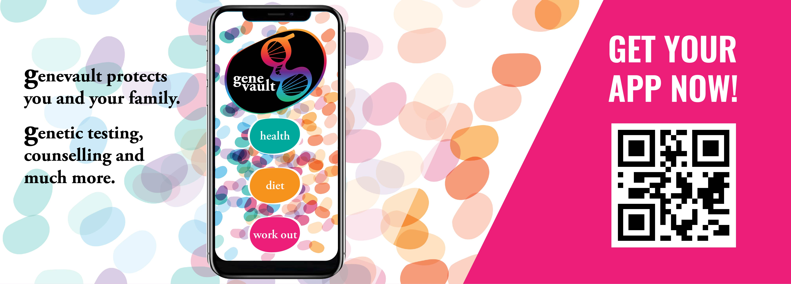

## Welcome to the Threat Fiction Bank

This fiction bank has been created as part of the [FiVu Project](https://spritehub.org/2021/09/02/fivu-using-design-fiction-to-identify-future-vulnerabilities-in-bio-iot/), funded by the [Sprite+ network](https://spritehub.org/) under EPSRC grant [EP/S035869/1](https://gow.epsrc.ukri.org/NGBOViewGrant.aspx?GrantRef=EP/S035869/1).

## Suggestions for Use
You can do this either alone or in group: Read the GeneVault Use Case and think about possible threats such an app could get. Read one of the Fictions and think about possible threats the app (and data) could get in such a world setting. Think about how those threats could be reflected in real life. Repeat for two other stories. Share your thoughts with your fellow developers.

## The Fictions

1. [Fictional Bio-IOT App Use Case](FiVu_Workshop_GeneVault_Use_Case.pdf) - Rough Specification of GeneVault, a Fictional Bio-IOT App for Smartphones.
2. [First fiction](FiVu_Workshop_Story_1.pdf) - What happens when GeneVault can control your devices? At home, at work, everywhere!
3. [Second fiction](FiVu_Workshop_Story_2.pdf) - Use GeneVault for social, political and economic gain.
4. [Third fiction](FiVu_Workshop_Story_3.pdf) - What can you do with a digital genome repository?

## Preliminay List of Threats 
[Compilation of Threats](Compilation_of_Threats.pdf) - A compilation of threats resulted from a quick survey on security experts who read the GeneVault Use Case only. Compare you lists with this one and share your thoughts with us.

## Support Contact

For questions, additions or suggestions please contact **Dr Cecilia Loureiro-Koechlin** or **Dr Charles Weir**, using the [contact details here](https://spritehub.org/2021/09/02/fivu-using-design-fiction-to-identify-future-vulnerabilities-in-bio-iot/).
